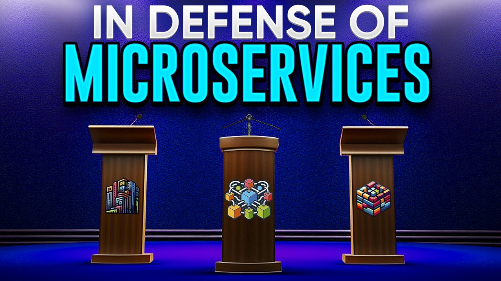

# In Defense of Microservices

## Elevator Pitch
Once hailed as the solution for modern applications, microservices are now criticized for complexity and operational bottlenecks. Here we will address critiques with practical solutions and showcase actual implementations. Discover why microservices still matter and how to adopt them effectively.

## Short Abstract
In a world divided on the merits of microservices, we return to the proven benefits of these architectural approaches to make the case for their continued relevance, including scalability and fault tolerance. In this final section, we will address some of the common criticisms of microservices with tangible options, provide real-world microservices case studies, and consider how microservices compare to alternative architectures so that you can make an educated decision and understand why microservices are still relevant in today’s software development environment.

## Abstract
In recent years, there has been a very mixed and often polarized conversation around microservices as an architectural style. Microservices were hailed as the solution for modern applications, but are criticized for their complexity and operational bottlenecks. This session will:

- **Reaffirm the core benefits of microservices**, including scalability, fault tolerance, and independent deployments.

- **Address common critiques from various experts** and propose practical solutions to mitigate these issues.

- **Showcase successful microservice implementations** and discuss lessons learned from successes and challenges encountered in real-world projects led by the presenter.

- **Compare microservices with other architectural styles**, such as monoliths, n-tier architecture, and modular monoliths.

Come and explore why microservices still matter and how they can be effectively adopted in your organization.

# Type
- 45/60/75-minute session

## Tags
- Microservices
- Software Architecture
- Modern Applications
- Event-Driven Architecture
- Best Practices

## Learning Objectives
- **Discover Why Microservices Benefits Matter:** This session will provide an overview of the key benefits of microservices, including scalability, fault isolation, and independent teams and deployments, and explain why these benefits are crucial for modern applications.
- **Lean into Microservices:** A session focused on taking typical challenges to microservices architecture as a starting point to practically show that microservices are the way to approach architecture, covering strategies, best practices, challenges, and solutions to reduce complexity, avoid operational bottlenecks, and poor performance.
- **Comparing Microservices to Other Architectural Styles:** The session will enable attendees to contrast microservices with different architectural styles, such as a modular monolith, and determine how to choose the right approach for their project and organization based on their specific needs.
## Presentations

| Event | Location | Date | Time | Room | Downloads |
|-------|:--------:|-----:|-----:|-----:|----------:|
| [dev up 2025](https://devupconf.org/) | St. Charles, MO | 07-AUG-2025 | 4:00 PM CDT | 101 | [Slides](EventMaterials/InDefenseOfMicroservices-DevUp2025.pdf) |
| [Conf42 Cloud Native 2025](https://www.conf42.com/Cloud_Native_2025_Chad_Green_microservices_architecture_defense) | Online | 06-MAR-2025 | 12:00 PM EST | N/A | [Slides](EventMaterials/InDefenseOfMicroservices-Conf42.pdf) |

## Resources
There are no additional resources for this presentation.

Email [chadgreen@chadgreen.com](mailto:chadgreen@chadgreen.com?subject=Presentation%20Request:%20Presentation%20Title) to have Chad present this session at your event.
